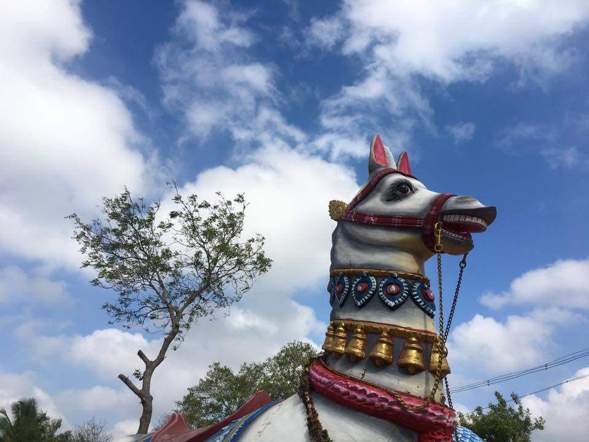

# rotate-image 

Rotates a given image by n degrees with node-canvas.

### Install

* Run `npm install -g @astronomersiva/rotate-image`.

### Usage

* `dest` is optional. Defaults to `rotated-${src}`.

```
(async () => {
  const rotate = require('rotate-image');
  const options = {
    src: 'hello.png',
    dest: 'rotated.png',
    rotation: 60
  };

  await rotate(options);
})();
```

### Screenshots

Before Rotation


After Rotation

